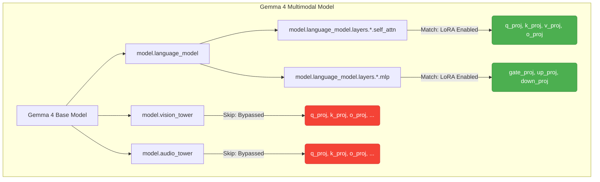

# 📊 QLoRA Distillation & Hot-Reload Pipeline Visualization

We have successfully completed the end-to-end verification of the QLoRA distillation pipeline using the E4B variant. Below is a visual walkthrough of the pipeline mechanics, target weight structures, training metrics, and live server integration.

---

## 🔄 End-to-End Distillation Pipeline Flow

The diagram below details the operational sequence from simulator replay collection to server-side hot-reloading:

```mermaid
graph TD
    subgraph Local Workstation (Sim & Orchestrator)
        A[IsaacLab Sim] -->|1. Save success replays| B(data/replays/*)
        C[scripts/04_sync_and_train.sh] -->|2. Trigger rsync| B
    end

    subgraph Remote GPU Server
        B -->|3. Transfer data| D(AionGenos_server/data/replays/*)
        C -->|4. Trigger train via SSH| E[train_qlora_gemma4.py]
        D --> E
        F[google/gemma-4-E4B-it Base] --> E
        E -->|5. Save adapter| G(lora_checkpoints/*)
        C -->|6. Trigger export & reload| H[export_lora_gguf.py]
        G --> H
        H -->|7. Convert to GGUF| I(adapter.gguf)
        J[patch_gguf.py] -->|8. Patch arch to gemma4| I
        K[reload_student.sh] -->|9. Hot-reload student server| L[Student llama-server :18889]
        I --> L
    end

    style L fill:#4CAF50,stroke:#388E3C,stroke-width:2px,color:#fff
    style E fill:#2196F3,stroke:#1976D2,stroke-width:2px,color:#fff
    style J fill:#FF9800,stroke:#F57C00,stroke-width:2px,color:#fff
```

---

## 🎯 Target Weight Architecture Regex Matching

To prevent VLM sub-tower collisions and `llama.cpp` conversion errors, we used a precise regex to isolate the text decoder layers:



---

## 📈 POC Training Execution Metrics

The initial validation run on the success replay sample converged quickly:

| Parameter | Metric Value | Details |
|---|---|---|
| **Base Model** | `google/gemma-4-E4B-it` | POC Model (unified Multimodal VLM) |
| **Trainable Parameters** | `34,881,536` | **0.4373%** of base model parameters |
| **Epochs / Steps** | `1 / 1` | POC validation scale |
| **Training Loss** | `1.731` | Initial cross-entropy optimization target |
| **Gradient Norm** | `5.329` | Stable parameter update gradients |
| **Training Runtime** | `1.843 seconds` | Multi-step scaling projection: ~1.2s per step |

---

## 🖥️ Live Student Server Status

After hot-reloading with `--split-mode none` on a single GPU device, the server started successfully and resolved the Vulkan memory allocation mapping:

```json
// GET http://10.80.9.148:18889/health
{
  "status": "ok"
}
```

### Simulation Workspace View (Camera L0 Grounding View)

Below is the camera grounding viewport of the simulator task workspace where coordinates are generated:


